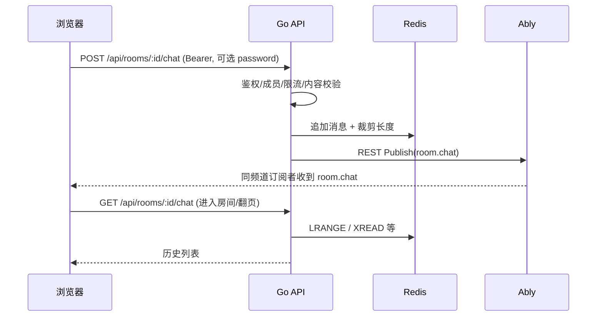

# 房间内实时聊天 — 设计说明（Ably 共用频道 + Redis 仅存）

> 面向当前代码库：`WatchTvTogether`（Go + Ably REST 发布）与 `WatchTvTogether-Web`（Vue + Ably Realtime 订阅）。  
> 目标：与**房间控制/同步**共用同一 Ably 频道；聊天记录**仅 Redis**、**与房间生命周期一致**、**不落盘**（不写 PostgreSQL）。

---

## 1. 现状摘要（与方案衔接）

### 1.1 Ably 频道

- 频道名：`{AblyChannelPrefix}:room:{roomId}:control`（见 `internal/realtime/ably/service.go` 的 `ChannelName`）。
- 后端已通过 **Ably REST** 向该频道发布：`room.snapshot`、`room.sync`、`room.event`（及错误等）。
- 前端 `useRoomRealtime.ts` 订阅同一频道，并处理 `room.sync` / `room.event` / `room.snapshot`；**Presence** 也在该频道上。

### 1.2 JWT 能力

- 当前房间 JWT 能力为：`subscribe`、`presence`、`history`（**无** `publish`）。
- 因此客户端**不能**直接向 Ably 频道发聊天消息并由服务端“顺带”写入 Redis；聊天发送应走 **HTTP API**，由服务端校验后 **REST Publish** 到同一频道（与现有播放控制一致）。

### 1.3 房间结束与 Redis 清理

- `CloseRoom` / `closeEmptyRoom` 会删除 Redis 中的房间状态、presence、room access 等，并发布 `room.event`（如 `room_closed`）。
- 聊天 Redis 键必须在**同一套清理路径**中删除，才能保证“生命周期与房间一致”。

### 1.4 缓存后端

- `cache_backend` 可为 `memory` 或 `redis`。生产聊天建议 **仅在有 Redis 时启用完整能力**；`memory` 下可实现进程内列表（多实例不一致、重启丢失），或明确文档化“聊天仅 redis 模式可用”。

---

## 2. 设计目标与非目标

### 2.1 目标

| 目标 | 说明 |
|------|------|
| 共用频道 | 聊天实时推送使用与播放同步相同的 Ably channel，前端一个 `RealtimeChannel` 即可。 |
| 仅存 Redis | 权威历史在 Redis；PostgreSQL 不建聊天表。 |
| 生命周期一致 | 房间关闭 / 空房间清理 / 房主销毁房间时，删除聊天相关 key。 |
| 鉴权一致 | 与 snapshot、Ably token 一致：已登录、成员身份、私有房密码 / access grant。 |

### 2.2 非目标（可后续迭代）

- 全局搜索、合规审计长期存档、跨房间导出。
- 基于 Ably Serverless 的客户端直发 + 异步落库（本方案以 HTTP + 服务端写 Redis 为主）。
- 复杂富文本（可先纯文本 + 长度上限）。

---

## 3. 总体架构



- **实时**：Ably（与 `room.sync` 同频道）。
- **历史与回放**：Redis（进入房间或打开聊天面板时由 HTTP 拉取）。
- **Ably `history` 能力**：与“聊天不落盘”不矛盾：可不启用 Ably 持久化；客户端对聊天的“历史回放”**不要**依赖 `channel.history()`，而以 Redis + HTTP 为准。若产品上仍保留 `history` 权限用于其它用途，需在文档中写明聊天不以 Ably history 为数据源。

---

## 4. 消息契约

### 4.1 Ably 消息名（建议）

- 新增常量：`MessageNameChat = "room.chat"`（与 `room.sync` 等并列）。
- 负载为 JSON，与现有 `room.Message` 风格统一，建议字段：

```json
{
  "type": "chat",
  "seq": 123,
  "room_id": "…",
  "user": { "id": "…", "username": "…", "nickname": "…", "role": "…" },
  "text": "…",
  "sent_at": 1710000000
}
```

- `seq`：单调递增（见 §5），便于前端去重、排序、缺口检测。
- **系统事件**（可选）：如 `type: "chat_cleared"` 房主清空记录，仍走 `room.chat` 或并入 `room.event`；若并入 `room.event`，前端需两处监听，建议**统一用 `room.chat` 传用户消息**，房间级通知继续用 `room.event`。

### 4.2 HTTP API（建议）

1. **发送** `POST /api/rooms/:roomId/chat`  
   - Body：`{ "text": "..." }`  
   - 响应：`{ "seq": ..., "sent_at": ... }` 或完整消息对象。  
   - 错误：`400` 长度/内容、`401`、`403` 非成员或私有房校验失败、`429` 限流。

2. **历史** `GET /api/rooms/:roomId/chat?before_seq=&limit=`  
   - `before_seq` 可选：分页游标（向更早翻页）。  
   - `limit` 默认 50，上限例如 200。  
   - 响应：`{ "items": [ ... ], "has_more": bool }`。

3. **（可选）** `DELETE /api/rooms/:roomId/chat`  
   - 仅房主/管理员：清空 Redis 列表并发一条 `chat_cleared` 或 `room.event`。

**是否在 snapshot 中带聊天**：不建议把完整历史塞进 snapshot（体积与职责）；可在进房后并行请求 `GET .../chat`。

---

## 5. Redis 数据模型

### 5.1 方案 A：LIST + 元数据（实现简单）

- Key：`{appPrefix}:room:{roomId}:chat`  
  - `LPUSH` 新消息 JSON 字符串（或 hash 序列化）。  
  - `LTRIM 0 maxN-1` 控制最多保留条数（如 500～2000，可配置）。  
- 序号：单独 key `{...}:chat:seq` 使用 `INCR` 作为全局 `seq`。  
- 删除房间：`DEL room:{id}:chat room:{id}:chat:seq`（在 `CloseRoom` / `closeEmptyRoom` 中调用）。

**优点**：实现快、按时间顺序与 `LPUSH`+`LRANGE` 直观。  
**缺点**：按 `seq` 分页需要扫描或额外索引；若需高效 `before_seq`，可用方案 B。

### 5.2 方案 B：Redis Stream（更适合分页与游标）

- Key：`{prefix}:room:{roomId}:chat:stream`  
- `XADD` 生成消息 ID；`seq` 可用字段存储或用 ID 时间序。  
- 删除：`DEL` stream key。  
- 分页：`XRANGE` / `XREAD` 配合 `before_seq` 映射到 ID（需在文档中定义查询策略）。

**建议**：若产品明确要“无限滚动 + 稳定游标”，优先 Stream；若 MVP 只要最近 N 条，LIST 足够。

### 5.3 TTL

- 若坚持“**仅**随房间删除而删除”，可**不设 TTL**（与房间 Redis 状态一致）。  
- 若担心泄漏，可对 chat key 设置与 `room state` 相近的 TTL 作为兜底（需与“房间仍存在”场景不冲突，谨慎）。

### 5.4 多实例与 memory 后端

- **Redis**：多 API 实例共享，一致。  
- **Memory**：需 `internal/cache/memory` 增加聊天存储接口，且**不跨进程**；或功能检测 `redis == nil` 时返回 `503`/文档说明不可用。

---

## 6. 服务端模块划分（建议）

| 模块 | 职责 |
|------|------|
| `internal/cache/redis/room_chat.go`（及 memory 空实现） | `Append`、`ListBeforeSeq`、`Clear`、`DeleteByRoom` |
| `internal/api/room_handlers.go` 或独立 `chat_handlers.go` | 路由、绑定 Gin、调用 room service |
| `internal/room/hub.go`（或子 service） | `SendChat`、`ListChat` 内聚鉴权委托 |
| `CloseRoom` / `closeEmptyRoom` | 调用 `DeleteByRoom` |

**限流**：每用户每房间每秒 N 条、每日可选；可用 Redis `INCR` + 过期或现有中间件。

**内容安全**：最大长度（如 2000 字符）、Unicode 规范化、可选敏感词占位；XSS 由前端转义展示。

---

## 7. 鉴权与私有房

- 与 `ablyToken`、`snapshot` 对齐：中间件校验 JWT；校验用户在该房间的成员关系；私有房校验 `password` 或与 `roomAccess` grant 一致。  
- 避免仅依赖 Ably clientId 作为身份来源；**发送与读历史均以服务端 session 为准**。

---

## 8. 前端（WatchTvTogether-Web）

### 8.1 实时

- 在 `useRoomRealtime.ts` 的 `normalizeAblyMessage` 中增加 `name === 'room.chat'` 分支，映射到统一类型（如 `type: 'chat'`）。  
- `events` 当前只保留 30 条：聊天可与播放事件**分轨**（建议 `chatEvents` ref 或独立 composable `useRoomChat.ts`），避免挤掉同步消息。  
- UI：`RoomView.vue` 侧边或底部抽屉：列表 + 输入框；进入房间后 `GET .../chat` 拉首屏，收到 `room.chat` 时 append（按 `seq` 去重）。

### 8.2 发送

- `api.ts` 增加 `postRoomChat`、`fetchRoomChatHistory`。  
- 发送失败展示 `ApiError` 信息；成功可乐观更新或等 Ably 回显（推荐**以服务端返回 seq + Ably 广播为准**，减少乱序）。

### 8.3 房间关闭

- 已订阅 `room.event`：收到 `room_closed` 时清空本地聊天列表并禁用输入（若已有逻辑，可扩展）。

---

## 9. 与“共用频道”相关的注意点

- **带宽与单频道负载**：聊天量大时与控制消息同频道会增加单 channel 流量；一般房间规模可接受。若未来超大，可再拆子频道（违背当前需求时再议）。  
- **消息名隔离**：使用独立 `room.chat`，前端按 `message.name` 分发，避免与 `room.sync` 解析混淆。  
- **不增加客户端 publish 权限**：降低伪造来源风险；所有消息经服务端带 `user` 对象发布。

---

## 10. 测试与验收

| 项 | 说明 |
|----|------|
| 单元测试 | Redis mock 或 miniredis：`Append` 后 `List` 顺序、`LTRIM` 上限、`DeleteByRoom`。 |
| API 测试 | 扩展 `router_test.go`：成员可发可读、非成员 403、关闭房间后 key 不存在、历史为空。 |
| 前端 | vitest：normalize `room.chat`；可选 E2E。 |
| 手工 | 两浏览器同房间互发、刷新后历史仍在、房主关房后重开新房无旧消息。 |

---

## 11. 实施顺序建议（里程碑）

1. **Redis（+ memory no-op）接口** + 在 `CloseRoom`/`closeEmptyRoom` 挂接删除。  
2. **HTTP POST/GET** + Ably `PublishRoomMessage(..., "room.chat", payload)`。  
3. **前端** 订阅与 UI + API 调用。  
4. **限流、长度、错误码** 与 README 同步（对外可见行为）。  
5. （可选）房主清空、举报占位。

---

## 12. 风险与待决问题

- **Ably 消息大小**：单条聊天 JSON 需低于 Ably 单条消息限制（文档可查）；超长文本应截断或拒绝。  
- **顺序**：先写 Redis 再 Publish，失败时需定义：是否补偿重试、是否会出现“库里有但实时未达”（可接受短暂不一致或事务外补偿）。  
- **memory 后端**：产品需二选一：不支持聊天 vs 支持但仅限单实例开发。

---

## 13. 文档与配置

- 若增加 `CHAT_MAX_MESSAGES`、`CHAT_RATE_LIMIT` 等环境变量，需更新根 `README.md`。  
- Web README：说明聊天走 HTTP+Ably、历史不持久化到磁盘。

---

*本文件为设计计划，实现前若对外 API 或 Redis key 命名有变更，请再评审后编码。*
