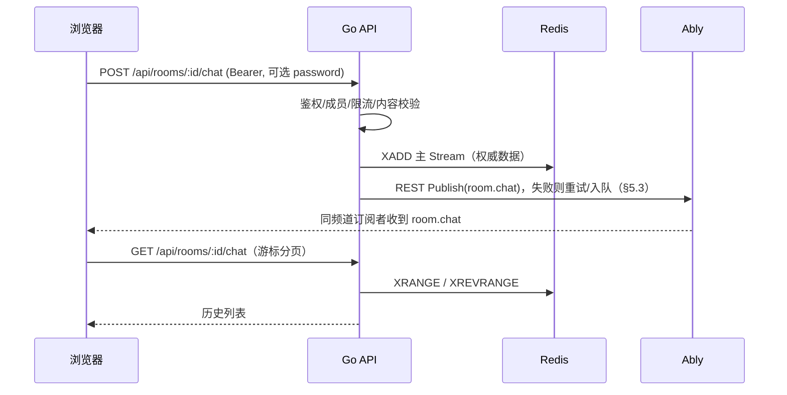

# 房间内实时聊天 — 设计说明（Ably 共用频道 + Redis Stream）

> 面向当前代码库：`WatchTvTogether`（Go + Ably REST 发布）与 `WatchTvTogether-Web`（Vue + Ably Realtime 订阅）。  
> 目标：与**房间控制/同步**共用同一 Ably 频道；聊天记录**仅 Redis（Stream）**、**与房间生命周期一致**、**不落盘**（不写 PostgreSQL）。  
> **前提**：聊天功能依赖 Redis；部署使用 `cache_backend=redis`（与现有房间状态、presence 等一致），本文**不再**描述 memory 缓存后端下的聊天行为或占位实现。

---

## 1. 现状摘要（与方案衔接）

### 1.1 Ably 频道

- 频道名：`{AblyChannelPrefix}:room:{roomId}:control`（见 `internal/realtime/ably/service.go` 的 `ChannelName`）。
- 后端已通过 **Ably REST** 向该频道发布：`room.snapshot`、`room.sync`、`room.event`（及错误等）。
- 前端 `useRoomRealtime.ts` 订阅同一频道，并处理 `room.sync` / `room.event` / `room.snapshot`；**Presence** 也在该频道上。

### 1.2 JWT 能力

- 当前房间 JWT 能力为：`subscribe`、`presence`、`history`（**无** `publish`）。
- 因此客户端**不能**直接向 Ably 频道发聊天消息并由服务端“顺带”写入 Redis；聊天发送应走 **HTTP API**，由服务端校验后 **REST Publish** 到同一频道（与现有播放控制一致）。

### 1.3 房间结束与 Redis 清理

- `CloseRoom` / `closeEmptyRoom` 会删除 Redis 中的房间状态、presence、room access 等，并发布 `room.event`（如 `room_closed`）。
- 聊天相关 Redis key（主 Stream、序号、待投递集合等，见 §5）必须在**同一套清理路径**中删除，才能保证“生命周期与房间一致”。

---

## 2. 设计目标与非目标

### 2.1 目标

| 目标 | 说明 |
|------|------|
| 共用频道 | 聊天实时推送使用与播放同步相同的 Ably channel，前端一个 `RealtimeChannel` 即可。 |
| 仅存 Redis Stream | 权威历史在 Redis Stream；PostgreSQL 不建聊天表。 |
| 生命周期一致 | 房间关闭 / 空房间清理 / 房主销毁房间时，删除聊天相关 key。 |
| 鉴权一致 | 与 snapshot、Ably token 一致：已登录、成员身份、私有房密码 / access grant。 |
| 失败可恢复 | Ably REST 发布失败时有明确策略：同步重试 + 可选待投递索引由后台补发（§5.3）。 |

### 2.2 非目标（可后续迭代）

- 全局搜索、合规审计长期存档、跨房间导出。
- 基于 Ably Serverless 的客户端直发 + 异步落库（本方案以 HTTP + 服务端写 Redis 为主）。
- 复杂富文本（可先纯文本 + 长度上限）。

---

## 3. 总体架构



- **实时**：Ably（与 `room.sync` 同频道）。
- **历史与回放**：Redis Stream + HTTP；**不要**依赖 Ably `channel.history()` 作为聊天数据源。
- **Ably `history` 能力**：与“聊天不落盘”不矛盾；客户端聊天回放以 Redis + HTTP 为准。

---

## 4. 消息契约

### 4.1 Ably 消息名（建议）

- 新增常量：`MessageNameChat = "room.chat"`（与 `room.sync` 等并列）。
- 负载为 JSON，与现有 `room.Message` 风格统一，建议字段：

```json
{
  "type": "chat",
  "seq": 123,
  "stream_id": "1710000000000-0",
  "room_id": "…",
  "user": { "id": "…", "username": "…", "nickname": "…", "role": "…" },
  "text": "…",
  "sent_at": 1710000000
}
```

- `seq`：业务单调序号（见 §5.1），便于前端去重、排序、与 HTTP 分页对齐。
- `stream_id`：Redis Stream 返回的 ID，便于幂等、对账与待投递队列引用（与 `seq` 可同时存在）。
- **系统事件**（可选）：如 `type: "chat_cleared"`，可走 `room.event` 或单独 `room.chat`；建议房间级通知继续用 `room.event`，用户消息用 `room.chat`。

### 4.2 HTTP API（建议）

1. **发送** `POST /api/rooms/:roomId/chat`  
   - Body：`{ "text": "..." }`  
   - 响应：完整消息对象 + `seq` + `stream_id`；可选 `realtime: "ok" | "deferred"`（见 §5.3，表示同步推送是否已确认成功）。  
   - 错误：`400` 长度/内容、`401`、`403`、`429` 限流。

2. **历史** `GET /api/rooms/:roomId/chat?before_id=&limit=`  
   - 推荐使用 **Stream ID** 作为游标：`before_id` 表示「比该 ID 更早」的消息（配合 `XREVRANGE` 从新到旧拉页）。也可用 `before_seq` 若实现层建立 secondary 索引；MVP 用 `before_id` 最直接。  
   - `limit` 默认 50，上限例如 200。  
   - 响应：`{ "items": [ ... ], "has_more": bool }`，每条含 `stream_id` 与 `seq`。

3. **（可选）** `DELETE /api/rooms/:roomId/chat`  
   - 仅房主/管理员：清空 Stream（`DEL`）并发 `room.event` 或 `room.chat` 系统消息。

**是否在 snapshot 中带聊天**：不建议；进房后并行 `GET .../chat`。

---

## 5. Redis 数据模型（仅 Stream）

### 5.1 主 Stream 与字段

- Key：`{appPrefix}:room:{roomId}:chat:stream`（命名与现有 `room:*` key 风格对齐即可）。
- 写入：`XADD key MAXLEN ~ {N} * field1 val1 field2 val2 ...`  
  - `MAXLEN ~ N`：近似裁剪上限条数（可配置，如 2000），避免单房间无限增长。  
  - 字段建议（示例）：`seq`、`user_id`、`payload`（整条 JSON 字符串）或拆字段 `text`、`username` 等；**推荐存一份完整 JSON 字符串**在 `payload`，查询时反序列化，减少字段演进成本。
- 业务序号 `seq`：单独 key `{...}:room:{roomId}:chat:seq` 使用 `INCR`，在 `XADD` 前生成，保证与 Ably 载荷一致。
- 删除房间：`DEL` 该 Stream + `DEL` seq key + `DEL` 待投递 key（§5.3），在 `CloseRoom` / `closeEmptyRoom` 中执行。

### 5.2 分页与查询

- 最新一页：`XREVRANGE key + - COUNT limit`。  
- 更早：`XREVRANGE key (before_id - COUNT limit`（Redis 开区间语法用 `(` 排除已见最后一条）。  
- 若将来需要按 `seq` 随机定位，可另设 ZSET `seq -> stream_id` 索引；MVP 用 `stream_id` 游标即可。

### 5.3 Ably 发布失败：**重试** 与 **Redis 待投递标记**（二段式）

核心事实：**先 `XADD` 成功则消息已对客户端可见（HTTP 历史）**，与 Ably 是否成功解耦。Stream 条目**不宜**在写入后再改「是否送达 Ably」字段（无原生就地更新、语义也不清晰）。

推荐组合策略（由强到弱、实现递增）：

#### 阶段 1 — 请求内同步重试（必选基线）

- `XADD` 成功后调用 Ably REST `Publish`。  
- 对**可重试错误**（超时、5xx、网络抖动）做 **有限次数** 重试：例如 3～5 次，**指数退避 + 抖动**，单次请求总耗时设上限（避免阻塞 worker）。  
- 每次重试使用**相同** `stream_id` / `seq` / JSON 载荷，Ably 侧天然可去重（客户端按 `seq` 去重即可）。  
- 若在时限内成功：HTTP 响应 `realtime: "ok"`（或省略）。

#### 阶段 2 — Redis 待投递索引（可选，用于「重试耗尽仍失败」）

- 当同步重试仍失败：将 `stream_id`（或 `room_id`+`seq`）写入辅助结构，例如：  
  - `ZADD {prefix}:room:{roomId}:chat:ably_pending {unix_deadline} {stream_id}`  
  - 或使用 **Redis Stream** 作为 outbox：`XADD ...:chat:outbox * room_id ... stream_id ...`（与主 Stream 二选一即可，避免过多类型）。  
- 后台 **单飞定时任务**（或每实例带分布式锁的低频扫描）：对 pending 中到期项再次 `Publish`，成功则 `ZREM`。  
- HTTP 响应可返回 `realtime: "deferred"`，前端可提示「消息已保存，实时推送可能略有延迟」；列表仍以 HTTP/后续 Ably 为准。

#### 不推荐的做法

- **在 Stream 消息体里维护「已送达」布尔并回写**：Stream 不支持高效原地改字段；若 `XADD` 后再 `XADD` 一条「回执」会污染聊天时间线。  
- **仅依赖标记不重试**：标记应服务于「补发队列」，而不是替代同步重试。

#### 小结（直接回答「重试还是标记」）

| 手段 | 作用 |
|------|------|
| **同步重试** | 覆盖绝大多数瞬时故障，实现简单，应作为默认。 |
| **Redis 待投递集合（标记）** | 表示「权威已落 Stream，但 Ably 尚未确认」；供**异步补发**，与同步重试互补，**不是二选一互斥**。 |

---

## 6. 服务端模块划分（建议）

| 模块 | 职责 |
|------|------|
| `internal/cache/redis/room_chat.go` | `XADD`（含 MAXLEN）、`XREVRANGE` 分页、`DeleteByRoom`（含 pending key）、pending 入队/出队 |
| `internal/api/room_handlers.go` 或 `chat_handlers.go` | 路由、鉴权绑定 |
| `internal/room/hub.go`（或子 service） | `SendChat`（写 Stream → Publish 重试 → 可选 deferred）、`ListChat` |
| 后台补发（可选） | 扫描 `ably_pending`，带锁与退避；与 `MaybeRunGlobalCleanup` 类似的可挂载点 |
| `CloseRoom` / `closeEmptyRoom` | 删除 Stream、seq、pending 等所有聊天 key |

**限流**：每用户每房间每秒 N 条；可用 Redis `INCR` + 过期。

**内容安全**：最大长度、Unicode 规范化、前端转义展示。

---

## 7. 鉴权与私有房

- 与 `ablyToken`、`snapshot` 对齐：JWT、成员、私有房 password / grant。  
- **发送与读历史均以服务端 session 为准**，不信任 Ably clientId 作为写权限依据。

---

## 8. 前端（WatchTvTogether-Web）

### 8.1 实时

- `useRoomRealtime.ts` 增加 `room.chat` 分支；聊天与播放 **events 分轨**，避免 30 条上限挤掉同步。  
- 进房 `GET .../chat`；收到 `room.chat` 按 `seq` 去重追加。

### 8.2 发送

- `postRoomChat`；若响应 `realtime: "deferred"`，可做轻量提示。  
- 以服务端返回的 `seq` / `stream_id` 为准，避免与 Ably 乱序冲突。

### 8.3 房间关闭

- `room_closed` 时清空本地聊天并禁用输入。

---

## 9. 与「共用频道」相关的注意点

- 单频道流量随聊天增加；一般房间可接受。  
- 独立消息名 `room.chat`。  
- 不开放客户端 `publish` 能力。

---

## 10. 测试与验收

| 项 | 说明 |
|----|------|
| 单元测试 | miniredis / 集成：`XADD`+`MAXLEN`、`XREVRANGE` 分页、`DeleteByRoom` 删净、pending ZSET 入队/出队 |
| API 测试 | 成员可发可读、关闭房间后无 key、模拟 Ably 失败时重试次数与 deferred 行为 |
| 手工 | 双端互发、断网恢复后 pending 补发、刷新后历史完整 |

---

## 11. 实施顺序建议（里程碑）

1. **Redis Stream 封装** + `CloseRoom`/`closeEmptyRoom` 删除所有聊天 key。  
2. **HTTP POST/GET** + Ably Publish + **同步重试**。  
3. **（可选）** pending ZSET + 后台补发协程。  
4. **前端** 订阅与 UI。  
5. 限流、README、环境变量（`CHAT_STREAM_MAXLEN`、`CHAT_ABLY_MAX_RETRIES` 等）。

---

## 12. 风险与待决问题

- **Ably 消息大小**：单条 JSON 低于平台限制；超长拒绝或截断。  
- **请求延迟**：同步重试会增加 POST 尾延迟，需上限与超时。  
- **pending 堆积**：Ably 长时间不可用时 ZSET 增长，需监控 + 上限策略（例如超过 M 条拒绝新消息或仅允许 deferred）。

---

## 13. 文档与配置

- 新增环境变量时更新根 `README.md`。  
- Web README：聊天走 HTTP + Ably、历史在 Redis Stream、无 DB 持久化。

---

*本文件为设计计划，实现前若对外 API 或 Redis key 命名有变更，请再评审后编码。*
